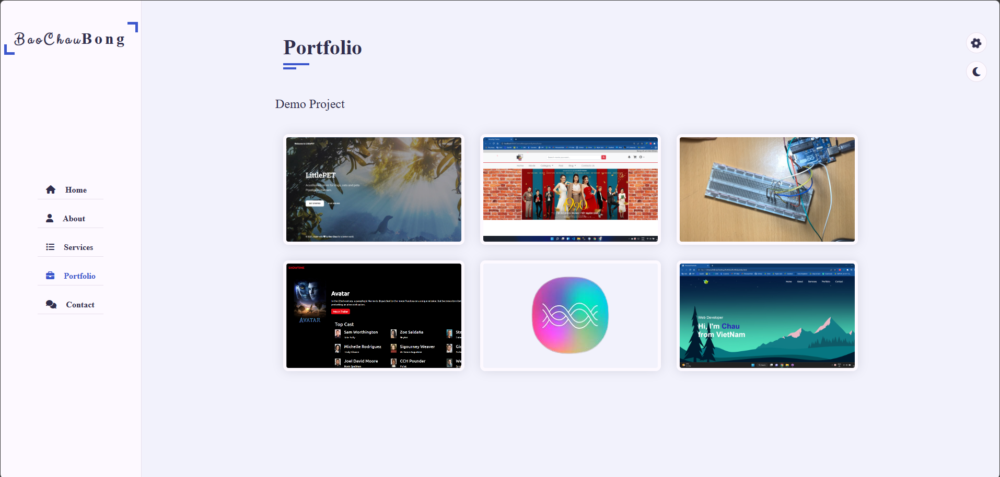

<h1 align="center">Portfolio</h1>

Responsive Personal Portfolio Website Design using HTML CSS and JavaScript

## Screenshots

### Homepage
 

### About
 

### Services

### Portfolio

### Contact

## Features
Switch pages with Javascript without reloading
  
Change Colors with Page when click choose colors
  
Change Dark Mode
  
Download CV
  
Send email to the owner and statistics on google sheet
  
Responsive Screen
